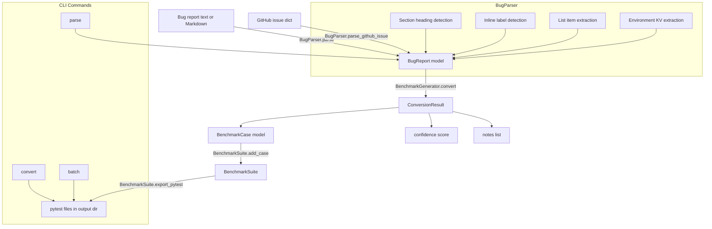

# aumai-bug2bench

Convert bug reports to reproducible pytest benchmarks.

[](https://github.com/aumai/aumai-bug2bench/actions)
[](https://pypi.org/project/aumai-bug2bench/)
[](LICENSE)
[](https://python.org)

---

## What is this?

A bug report is a promise: "I can show you this system breaking." A reproducible test case is
that promise made executable. The gap between a written bug report and a working pytest test is
often the difference between a bug that gets fixed and a bug that gets lost.

**aumai-bug2bench** bridges that gap. It parses plain-text and Markdown bug reports — including
GitHub issue format — extracts the structured information (steps to reproduce, expected
behaviour, actual behaviour, environment), and generates a pytest test file scaffold from that
information. The generated test starts as a documented placeholder, giving engineers a precise
specification of what to implement to confirm the fix.

The workflow is:

1. A user files a bug report (in Markdown, plain text, or via GitHub Issues)
2. `aumai-bug2bench` parses the report and extracts structured fields
3. A pytest test skeleton is generated, with the reproduction steps as comments and the
   expected behaviour as a documented assertion target
4. The engineer implementing the fix fills in the actual assertions and imports
5. The test is added to the regression suite and the bug is confirmed fixed when it passes

Think of it as a translator: bug reports are written in human language; test suites are written
in Python. `aumai-bug2bench` does the structural translation so that the human's time can focus
on the implementation logic.

---

## Why does this matter?

### The cost of unstructured bug reports

Most bug reports contain all the information needed to reproduce the bug. But that information
is buried in prose. The word "reproducible" is in the title of a thousand GitHub issues whose
bodies contain no reproduction steps at all. Even well-structured reports require an engineer
to manually translate "Step 3: call process('') with an empty string" into
`assert process('') == expected_result`.

This translation is low-value work. It is also work that is easy to forget, skip, or do
incorrectly. The result is that many fixed bugs have no regression test, and many reported bugs
are never confirmed as fixed.

**aumai-bug2bench** makes regression test creation a default outcome of bug reporting, not an
exceptional act of diligence.

---

## Architecture



The pipeline is three stages: parse, generate, export. Each stage is independent and can be
used without the others.

---

## Features

- **Markdown section parsing** — recognises `## Steps to Reproduce`, `## Expected Behavior`,
  `## Actual Behavior`, `## Environment` headings (case-insensitive)
- **Inline label parsing** — handles `Steps to Reproduce: ...` and `Expected: ...` formats
- **Ordered and unordered list extraction** — extracts numbered steps and bullet points
- **Environment key-value extraction** — parses `Python: 3.11`, `OS: linux` pairs
- **GitHub issue dict support** — `parse_github_issue` accepts GitHub REST API dicts directly
- **Confidence scoring** — 0.0–1.0 based on how complete the bug report is
- **Pytest scaffold generation** — full test function with docstring, step comments, and
  a descriptive `NotImplementedError` as the implementation target
- **Batch processing** — convert an entire directory of bug reports in one command
- **Suite export** — writes one pytest file per case plus a `conftest.py`
- **Tag extraction** — automatically tags `regression`, `error-handling`, `exception` cases
- **Zero LLM dependency** — all parsing is regex and structural, fully offline

---

## Installation

```bash
pip install aumai-bug2bench
```

---

## Quick Start

### Parse a bug report (CLI)

```bash
# Given a file bug.md:
# ## Title
# AttributeError on empty input
#
# ## Description
# Calling process('') with an empty string raises AttributeError.
#
# ## Steps to Reproduce
# 1. Import the module
# 2. Call process('')
# 3. Observe the AttributeError
#
# ## Expected Behavior
# Should return an empty result without raising.
#
# ## Actual Behavior
# AttributeError: 'NoneType' object has no attribute 'strip'
#
# ## Environment
# - Python: 3.11
# - OS: linux

aumai-bug2bench parse --input bug.md
```

Output (structured JSON):

```json
{
  "bug_id": "a1b2c3d4e5f6",
  "title": "AttributeError on empty input",
  "description": "Calling process('') with an empty string raises AttributeError.",
  "steps_to_reproduce": [
    "Import the module",
    "Call process('')",
    "Observe the AttributeError"
  ],
  "expected_behavior": "Should return an empty result without raising.",
  "actual_behavior": "AttributeError: 'NoneType' object has no attribute 'strip'",
  "environment": {"python": "3.11", "os": "linux"}
}
```

### Convert a bug report to a pytest test (CLI)

```bash
aumai-bug2bench convert --input bug.md --output benchmark/
```

This writes `benchmark/test_<case_id>.py` and `benchmark/conftest.py`. The generated test
looks like:

```python
import pytest


def test_attributeerror_on_empty_input() -> None:
    """Regression for: AttributeError on empty input

    Original bug: a1b2c3d4e5f6
    Expected: Should return an empty result without raising.
    Actual (buggy): AttributeError: 'NoneType' object has no attribute 'strip'
    """
    # Steps to reproduce:
    # 1. Import the module
    # 2. Call process('')
    # 3. Observe the AttributeError
    # TODO: Replace with actual module/function call
    raise NotImplementedError(
        "Implement this test: reproduce the bug, then assert the fix."
        "\nExpected: Should return an empty result without raising."
    )
```

### Batch convert a directory

```bash
aumai-bug2bench batch --input-dir bugs/ --output benchmarks/ --pattern "*.md"
```

### Python API

```python
from aumai_bug2bench import BugParser, BenchmarkGenerator, BenchmarkSuite

parser = BugParser()
bug = parser.parse(open("bug.md").read())

generator = BenchmarkGenerator()
result = generator.convert(bug)

print(f"Confidence: {result.confidence:.0%}")
print(f"Test code:\n{result.benchmark.test_code}")

suite = BenchmarkSuite()
suite.add_case(result.benchmark)
suite.export_pytest("benchmark/")
```

---

## CLI Reference

### `aumai-bug2bench parse`

Parse a bug report file and print structured JSON.

```
Usage: aumai-bug2bench parse [OPTIONS]

Options:
  --input PATH    Path to the bug report file (Markdown or plain text).  [required]
  --output PATH   Optional path to write JSON output.
  --version       Show version and exit.
  --help          Show this message and exit.
```

**Example:**

```bash
aumai-bug2bench parse --input bug.md
aumai-bug2bench parse --input bug.md --output structured.json
```

---

### `aumai-bug2bench convert`

Convert a bug report to a pytest benchmark case.

```
Usage: aumai-bug2bench convert [OPTIONS]

Options:
  --input PATH        Path to the bug report file.  [required]
  --output PATH       Output directory for generated pytest files.  [default: benchmark]
  --json-output PATH  Optional path to write ConversionResult JSON.
  --help              Show this message and exit.
```

**Example:**

```bash
aumai-bug2bench convert --input bug.md --output benchmark/
aumai-bug2bench convert --input bug.md --output tests/regressions/ --json-output result.json
```

---

### `aumai-bug2bench batch`

Batch-convert all bug reports in a directory.

```
Usage: aumai-bug2bench batch [OPTIONS]

Options:
  --input-dir PATH   Directory containing bug report files.  [required]
  --output PATH      Output directory for generated pytest files.  [default: benchmark]
  --pattern TEXT     Glob pattern for bug report files.  [default: *.md]
  --help             Show this message and exit.
```

**Example:**

```bash
aumai-bug2bench batch --input-dir bugs/ --output benchmarks/ --pattern "*.txt"
```

---

## Python API Examples

### Parsing a GitHub issue dict

```python
from aumai_bug2bench import BugParser

parser = BugParser()

github_issue = {
    "number": 42,
    "title": "AttributeError: process() fails on empty string",
    "body": """## Steps to Reproduce
1. Call process('')
2. Observe AttributeError

## Expected Behavior
Return empty result.

## Actual Behavior
AttributeError raised.
""",
}

bug = parser.parse_github_issue(github_issue)
print(bug.bug_id)               # "gh-42"
print(bug.title)                # "AttributeError: process() fails on empty string"
print(bug.steps_to_reproduce)  # ["Call process('')", "Observe AttributeError"]
```

### Using confidence scores to filter low-quality reports

```python
from aumai_bug2bench import BugParser, BenchmarkGenerator

parser = BugParser()
generator = BenchmarkGenerator()

reports = ["bug1.md", "bug2.md", "bug3.md"]
MIN_CONFIDENCE = 0.5

for filename in reports:
    with open(filename) as f:
        bug = parser.parse(f.read())
    result = generator.convert(bug)

    if result.confidence < MIN_CONFIDENCE:
        print(f"Skipping {filename} — confidence {result.confidence:.0%}")
        for note in result.notes:
            print(f"  - {note}")
    else:
        print(f"Processing {filename} — confidence {result.confidence:.0%}")
```

### Building a suite from multiple reports

```python
from pathlib import Path
from aumai_bug2bench import BugParser, BenchmarkGenerator, BenchmarkSuite

parser = BugParser()
generator = BenchmarkGenerator()
suite = BenchmarkSuite()

for report_path in Path("bugs/").glob("*.md"):
    bug = parser.parse(report_path.read_text())
    result = generator.convert(bug)
    suite.add_case(result.benchmark)
    print(f"Added: {result.benchmark.case_id} (confidence: {result.confidence:.0%})")

suite.export_pytest("tests/regressions/")
print(f"\nExported {len(suite.cases)} benchmark(s)")
```

---

## Bug Report Format

The parser recognises two formats:

### Markdown headings format (preferred)

Use `##` (or any heading level) for section headers:

```markdown
## Title
Short descriptive title here

## Description
Longer explanation of the problem.

## Steps to Reproduce
1. First step
2. Second step
3. Third step

## Expected Behavior
What should happen.

## Actual Behavior
What actually happens (the bug).

## Environment
- Python: 3.11
- OS: linux
- Package version: 1.2.3
```

### Inline label format

For shorter reports without headings:

```
Title: My bug title
Description: A short description of the problem.
Expected: The correct result.
Actual: The incorrect result.
```

### Fallback

If no structured sections are found, the entire text is treated as the description and
the first non-empty line becomes the title.

---

## Confidence Scoring

The confidence score (0.0–1.0) reflects how complete a bug report is. It is used by the
`BenchmarkGenerator` to signal how much of the test body can be auto-generated:

| Field populated           | Confidence contribution |
|---------------------------|-------------------------|
| `steps_to_reproduce`      | +0.25                   |
| `expected_behavior`       | +0.25                   |
| `actual_behavior`         | +0.25                   |
| `description`             | +0.25                   |

A report with all four fields has confidence `1.0`. A bare-minimum report with only a title
has confidence `0.0` and will produce a test with fully placeholder content.

---

## How It Works

### Parsing

1. The text is scanned for Markdown section headings using regex patterns for titles like
   `## Steps to Reproduce`, `## Expected Behavior`, etc. (case-insensitive, any heading level).
2. If headings are found, the text is split at each heading boundary and the content below
   each heading is assigned to the corresponding field.
3. If no headings are found, inline label patterns (`Expected: ...`, `Actual: ...`) are tried.
4. Steps are extracted from ordered (`1.`) and unordered (`-`, `*`) list items.
5. Environment variables are extracted from `Key: Value` or `Key - Value` pairs.
6. The title defaults to the first non-empty line if no `## Title` heading exists.

### Test generation

A Python function name is derived from the bug title by lowercasing, replacing
non-alphanumeric characters with underscores, and truncating to 60 characters.

The test body contains:
- A docstring with bug ID, expected, and actual behaviour
- One comment per reproduction step
- A `NotImplementedError` that encodes the expected behaviour as its message

This ensures the test fails descriptively until implemented, and passes once the implementation
satisfies the expected behaviour.

---

## Integration with Other AumAI Projects

| Project               | Integration pattern                                                            |
|-----------------------|--------------------------------------------------------------------------------|
| **aumai-maintainer**  | Feed classified bug issues from aumai-maintainer directly to bug2bench         |
| **aumai-specs**       | Use specification data to enrich generated test docstrings with spec references|
| **aumai-eval**        | Run the generated benchmarks through aumai-eval for structured reporting       |

---

## Contributing

1. Fork the repository and create a feature branch: `feature/<your-feature>`
2. Write tests alongside your implementation
3. Ensure `ruff check .` and `mypy --strict .` pass
4. Submit a pull request explaining why the change is needed

See [CONTRIBUTING.md](CONTRIBUTING.md) for the full guide.

---

## License

Apache License 2.0. See [LICENSE](LICENSE) for details.

---

## Part of AumAI

This project is part of [AumAI](https://github.com/aumai) — open source infrastructure for the
agentic AI era.
